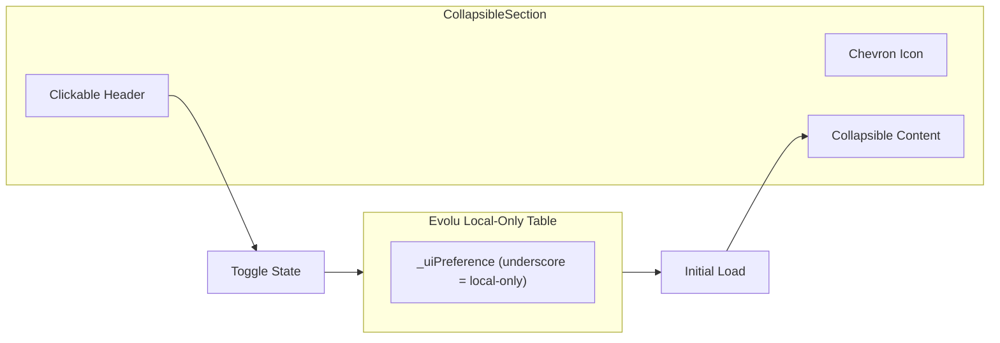

prompt:
Make every section on all pages foldable. 

On the main page, Record match and Ranking will be open by default, others folded by default. 
On /stats, keep both open by default.
On /match, make Record match section open by default, rest closed by default.

Remember the state changes to preserve after reload, but only locally, not shared across all instances.

You can use _ underscore prefix for evolu table to keep data local-only.

notes:
I had to convince the agent to use evolu, because it wasn't working at first try so it was rewriten to localStorage. But next iteration works.


plan:
---

name: Foldable Sections

overview: Create a reusable CollapsibleSection component with localStorage persistence, then update all three pages to use it with the specified default open/closed states.

todos:

- id: add-evolu-table

content: Add `_uiPreference` local-only table to Evolu schema with query and helpers

status: pending

- id: create-hook

content: Create `useCollapsibleState` hook using Evolu _uiPreference table

status: pending

  - id: create-component

content: Create `CollapsibleSection` component with header, chevron icon, and animated content

status: pending

  - id: update-index

content: Update main page with CollapsibleSection (Record match & Ranking open)

status: pending

  - id: update-stats

content: Update stats page with CollapsibleSection (both open)

status: pending

  - id: update-match

content: Update match page with CollapsibleSection (Record match open)

status: pending

---

# Foldable Sections with Local Persistence

## Architecture



## Implementation

### 1. Add `_uiPreference` Table to Evolu Schema

Update [`src/evolu/client.ts`](src/evolu/client.ts) to add a local-only table:

```typescript
const UiPreferenceId = Evolu.id("UiPreference");

const Schema = {
  // ... existing tables ...
  _uiPreference: {  // underscore prefix = local-only, not synced
    id: UiPreferenceId,
    key: Evolu.NonEmptyTrimmedString100,  // e.g. "section-home-ranking"
    isOpen: Evolu.SqliteBoolean,
  },
};
```

Create a query and export helpers for reading/writing UI preferences.

### 2. Create `useCollapsibleState` Hook

Create [`src/hooks/useCollapsibleState.ts`](src/hooks/useCollapsibleState.ts):

```typescript
export function useCollapsibleState(key: string, defaultOpen: boolean): [boolean, () => void] {
  // Query _uiPreference table for this key
  // If no row exists, use defaultOpen
  // On toggle: create or update the preference row
}
```

### 2. Create `CollapsibleSection` Component

Create [`src/components/CollapsibleSection.tsx`](src/components/CollapsibleSection.tsx):

- Props: `storageKey`, `title`, `defaultOpen`, `children`, optional `headerRight` (for the "STR" label on Ranking)
- Clickable header with chevron icon (rotates when open/closed)
- Smooth height transition for content
- Use Tabler icons (`@tabler/icons-react` is already installed - see `IconLoader2` in existing components)

### 3. Update Pages

**[`src/routes/index.tsx`](src/routes/index.tsx)** - Main page:

| Section | `storageKey` | `defaultOpen` |

|---------|--------------|---------------|

| Add player | `section-home-add-player` | `false` |

| Record match | `section-home-record-match` | `true` |

| Ranking | `section-home-ranking` | `true` |

| Match history | `section-home-match-history` | `false` |

| Account & sync | `section-home-account` | `false` |

**[`src/routes/stats.tsx`](src/routes/stats.tsx)** - Stats page:

| Section | `storageKey` | `defaultOpen` |

|---------|--------------|---------------|

| Ranking | `section-stats-ranking` | `true` |

| Match history | `section-stats-match-history` | `true` |

**[`src/routes/match.tsx`](src/routes/match.tsx)** - Match page:

| Section | `storageKey` | `defaultOpen` |

|---------|--------------|---------------|

| Record match | `section-match-record-match` | `true` |

| Match history | `section-match-match-history` | `false` |

| Ranking | `section-match-ranking` | `false` |

### 4. Styling

Use Tailwind CSS for:

- Chevron rotation transition (`transition-transform rotate-0` / `rotate-180`)
- Content height animation using `grid-rows-[0fr]` / `grid-rows-[1fr]` pattern for smooth collapse
- Cursor pointer on header