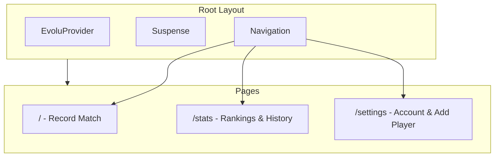

plan:
# Navigation and Pages Restructure

## Current State

- **Navigation**: Full bottom nav only on home (`/`), other pages use `BackNavigation` with "Back to Home"
- **Routes**: `/` (home), `/match`, `/stats`
- **Home page**: Contains Add Player, Record Match, Ranking, Match History, and Account & Sync sections

## Changes

### 1. Update Navigation Component

Modify [`src/components/Navigation.tsx`](src/components/Navigation.tsx) to show three tabs in this order:

- **Match** (`/match`) - with trophy icon
- **Stats** (`/stats`) - with chart icon  
- **Settings** (`/settings`) - with settings/gear icon (new)

Remove the "Home" link entirely.

### 2. Move Navigation to Root Layout

Move the `Navigation` component from individual pages to [`src/routes/__root.tsx`](src/routes/__root.tsx) so it appears on every page automatically. This eliminates the need for `BackNavigation`.

### 3. Create Settings Page

Create new route [`src/routes/settings.tsx`](src/routes/settings.tsx) with:

- Header: "Table Tennis League" with player/match counts (same as current home)
- "Account & Sync" section (`OwnerSection`) - **defaultOpen: true**
- "Add player" section (`AddPlayerForm`) - **defaultOpen: false** (collapsed)

### 4. Update Match Page

Modify [`src/routes/match.tsx`](src/routes/match.tsx):

- Remove `BackNavigation` import and usage
- Keep the rest as-is (Record Match, Match History, Ranking sections)

### 5. Update Stats Page

Modify [`src/routes/stats.tsx`](src/routes/stats.tsx):

- Add bottom padding (`pb-20`) to account for fixed navigation
- Keep content as-is (Ranking, Match History)

### 6. Update Index Route

Modify [`src/routes/index.tsx`](src/routes/index.tsx):

- Remove entirely and set `/match` as the default route

### 7. Delete BackNavigation

Delete [`src/components/BackNavigation.tsx`](src/components/BackNavigation.tsx) as it's no longer needed.

## Architecture After Changes

## Navigation Tab Order

1. Match (trophy icon) - `/`
2. Stats (chart icon) - `/stats`  
3. Settings (gear icon) - `/settings`